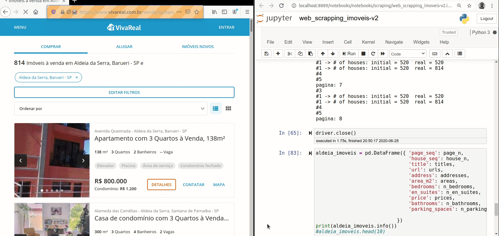

# ALDEIA DA SERRA REAL ESTATE

créditos da foto: https://flaviogfranca.com.br/

### INTRO

This is my very first WEB SCRAPING project developed to exercise recently acquired knowledge on Selenium and BeautifulSoup. It's the first part of a major project that will include also data cleansing, exploratory data analysis, machine learning model and deployment.

### FULL PROJECT:

- [x] 1. Web Scraping
- [ ] 2. Data Cleansing
- [ ] 3. EDA - Exploratory Data Analysis (TBD)
- [ ] 4. Machine Learning Model (TBD)
- [ ] 5. Model Deplyment (TBD)

### MOTIVATION

It's widely known that real life projects are quite more challenging than those we usually find in courses or dataset repositories. Thus the motivation is **to develop a simple yet original  project** - not based on readly available datasets -, **from idea to deploy** as a mean to exercise, improve and show my ongoing Data Science skills.

### SUBJECT

Aldeia da Serra village, a suburban housing neighbourhood located 35km far from Sao Paulo city Brazil. It's a place with about 10 housing condominiuns where people live close to nature and not too far from workplace. Although traffic is usually heavy and it takes about 30' to get to Alphaville region about 90' to Sao Paulo city.

As a motorcycle enthusiastic, it usually takes me about 45' to reach Sao Paulos's southern region. Yes, I live at Aldeia da Serra and for me the proximity to the Nature is worth the distance from workplace. Additionally, recent developments of Covid-19 has been acellerating the adoption and expansion of **work from home** modality among entreprises, which may decrease the necessity to commute.

### AIM

The aim of this project is to automate the collection of real estate advertisings from <a href= "http://vivareal.com.br"> Viva Real </a> marketplace web site using web scraping technology in compliance with the site rules stated in the robots.txt file. 

The following information will be extracted for each real estate:

1. address
2. title
3. area in square meters (m2)
4. number of bedrooms
5. number of bathrooms
6. number of car spaces
7. price asked
8. url

As we can see there are some data cleansing to be done (e.g. to split the address into street name, street number and city) in the second phase of the project.

### CHALLENGES

* Several searches are needed to get all houses on sale at  Aldeia da Serra region because there are three cities in the region (Santana de Parnaiba, Barueri and Itapevi) and some houses are published under the name of the condominium.

* Asynchronus loading: Viva Real site was built with Java Script search results are loaded in two steps changing by number of houses in each step. It required more research.
 
 * It's my very first project using Python.

### SOLUTION

### REFERENCES

* Tutorial: Web Scraping and BeautifulSoup - Alex Olteanu Dataquest
  https://www.dataquest.io/blog/web-scraping-beautifulsoup/

* Web scraping com python —Selenium e Javascript - Henrique Coura
https://medium.com/@henriquecoura_87435/web-scraping-com-python-selenium-e-javascript-faa108f95bbe

* Advanced Python Web Scraping: Best Practices & Workarounds - Satwik Kansal Codementor
https://www.codementor.io/blog/python-web-scraping-63l2v9sf2q

* Como fazer um README.md BONITÃO - Raul Esteves
https://medium.com/@raullesteves/github-como-fazer-um-readme-md-bonit%C3%A3o-c85c8f154f8

### FURTHER DEVELOPMENTS

* Use a tool such as Airflow to automate the web scraping execution.

* Create a cloud database and add new house advertisements incrementally.
