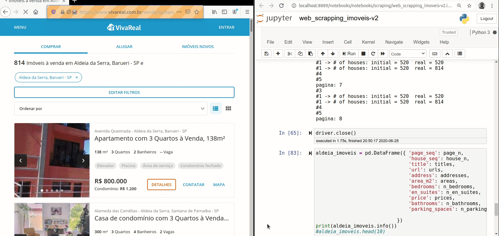
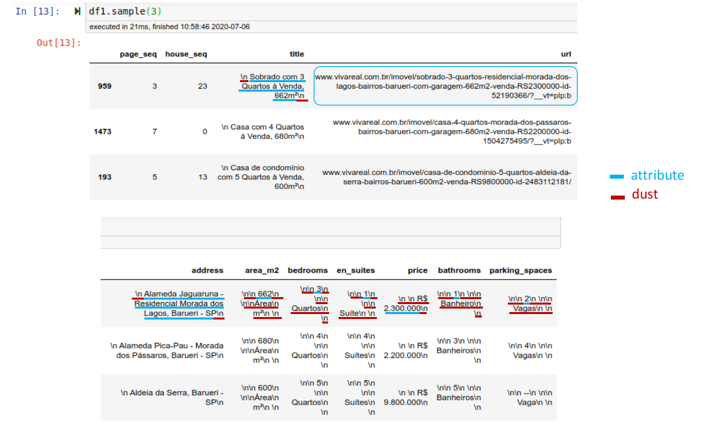
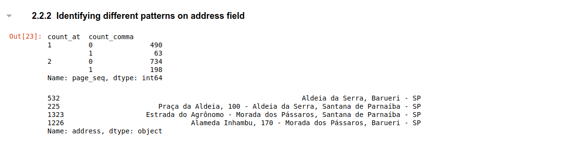
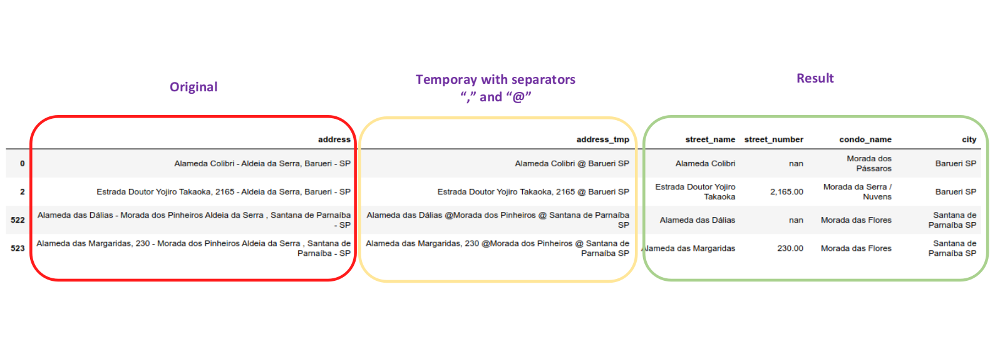

# ALDEIA DA SERRA REAL ESTATE

créditos da foto: https://flaviogfranca.com.br/

# FULL PROJECT:

- [x] [1. Web Scraping](#web-scraping)
- [x] [2. Data Cleansing](#data-cleansing)
- [ ] 3. EDA - Exploratory Data Analysis (TBD)
- [ ] 4. Machine Learning Model (TBD)
- [ ] 5. Model Deployment (TBD)

## INTRO

This is my very first Python project developed to exercise **Python programming, Web Scraping and Machine Learning skills** that I've been developing in the last 18 months together with other tools.

It's comprised of 5 sections mentioned above and **ultimate goal** is to **recommend price for new houses advertisements** by considering its attributes such as constructed area, condominium where it's located, number of bedrooms, number of bathrooms, number of en suites and number of car spaces. That tool would be used to

This is intended to be the first of a series of projects that will also include machine learning models for forecasting, classification, recommendation and so on.

I'll also include information about Business intelligence projects that are already developed, including ETL processes.

## MOTIVATION

It's widely known that real life projects are quite more challenging than those we usually find in courses or dataset repositories. Thus the motivation is **to develop a simple yet original project** - not based on readly available datasets -, **from idea to deploy** as a mean to exercise, improve and show my ongoing Data Science skills.

## SUBJECT

Aldeia da Serra village, a suburban housing neighbourhood located 35km west from Sao Paulo city, Brazil. It's a place with about 10 housing condominiuns where people live close to Nature and not too far from workplace. Although traffic is usually heavy and it takes about 30' to get to Alphaville region and about 90' to Sao Paulo city.

As a motorcycle enthusiastic, it usually takes me about 45' to reach Sao Paulos's southern region. Yes, I live at Aldeia da Serra and for me the proximity to the Nature is worth the distance from workplace. Additionally, recent developments of Covid-19 has been acellerating the adoption and expansion of **work from home** modality among entreprises, which may decrease the necessity to commute on a daily basis.

Well, let's go to the project itself!

# WEB SCRAPING

### AIM

The aim of this project is to automate the collection of real estate advertisings from <a href= "http://vivareal.com.br"> Viva Real </a> marketplace web site using web scraping technology in compliance with the site rules stated in the robots.txt file. 

The following information will be extracted for each real estate:

1. address
2. title
3. area in square meters (m2)
4. number of bedrooms
5. number of bathrooms
6. number of car spaces
7. price asked
8. url

As you might have antecipated there are some data transformation to be done (e.g. to split the address into street name, street number and city) that will be addressed in the second phase of the project.

### CHALLENGES

* Several searches are needed to get all houses on sale at  Aldeia da Serra region because there are three cities in the region (Santana de Parnaiba, Barueri and Itapevi) and some houses are published under the name of the condominium.

* Asynchronus loading: Viva Real site was built with Java Script search results are loaded in two steps changing by number of houses in each step. It required more research.
 
 * It's my very first project using Python.

### SOLUTION

Note how the page is loaded the first time displaying the total number of advertisements and then it's loaded again with a different number and different items. The correct number is the displayed at the first time and the correct items to be scraped are displayed afterwards.

### RESULTS

### REFERENCES

* Tutorial: Web Scraping and BeautifulSoup - Alex Olteanu Dataquest

https://www.dataquest.io/blog/web-scraping-beautifulsoup/

* Web scraping com python —Selenium e Javascript - Henrique Coura
https://medium.com/@henriquecoura_87435/web-scraping-com-python-selenium-e-javascript-faa108f95bbe

* Advanced Python Web Scraping: Best Practices & Workarounds - Satwik Kansal Codementor
https://www.codementor.io/blog/python-web-scraping-63l2v9sf2q

* Como fazer um README.md BONITÃO - Raul Esteves
https://medium.com/@raullesteves/github-como-fazer-um-readme-md-bonit%C3%A3o-c85c8f154f8

### FURTHER DEVELOPMENTS

* Get houses' descriptions to improve condo_name for adversiments without it.

* Get houses' attributes (e.g. swiming pool)

* Improve code by storing urls and page parameter to avoid code repetition.

* Use a ETL tool such as Airflow to automate the web scraping execution.

* Create a cloud database and add new house advertisements incrementally keeping
track of publication date.

# DATA CLEANSING

### AIM

To inspect and transform - clean, deduplicate, categorize and filter -,  the attributes scraped from Viva Real real estate market place in ways that it can be used for Exploratory Data Analysis (EDA) and Machine Model (ML) creation.

### CHALLENGES

1. House attributes scraped:

2. The above attributes were extracted and recorded as below:

In blue are the attributes to be cleaned from the dust, in red.

3. The most challeging attribute is the Address that must be splitted into street_name, street_number, condo_name and city, because the records are not homogeneous. Actually, there are 4 different patterns that get to be addressed:

### RESULTS

Cleaning preparation:

The four patterns are prepared using separators to be correctly splitted:

1. street name | city
2. street name | street number| neighbourhood | city
3. street name | condo name | neighbourhood | city
4. street name | street number| condo name | neighbourhood | city

Expected resuls:

- street name | street number | condo name |  city

### REFERENCES

* Getting started with Markdown - Felipe Song
https://github.com/fefong/markdown_readme

* StackEdit In-browser Markdown Editor
https://stackedit.io/